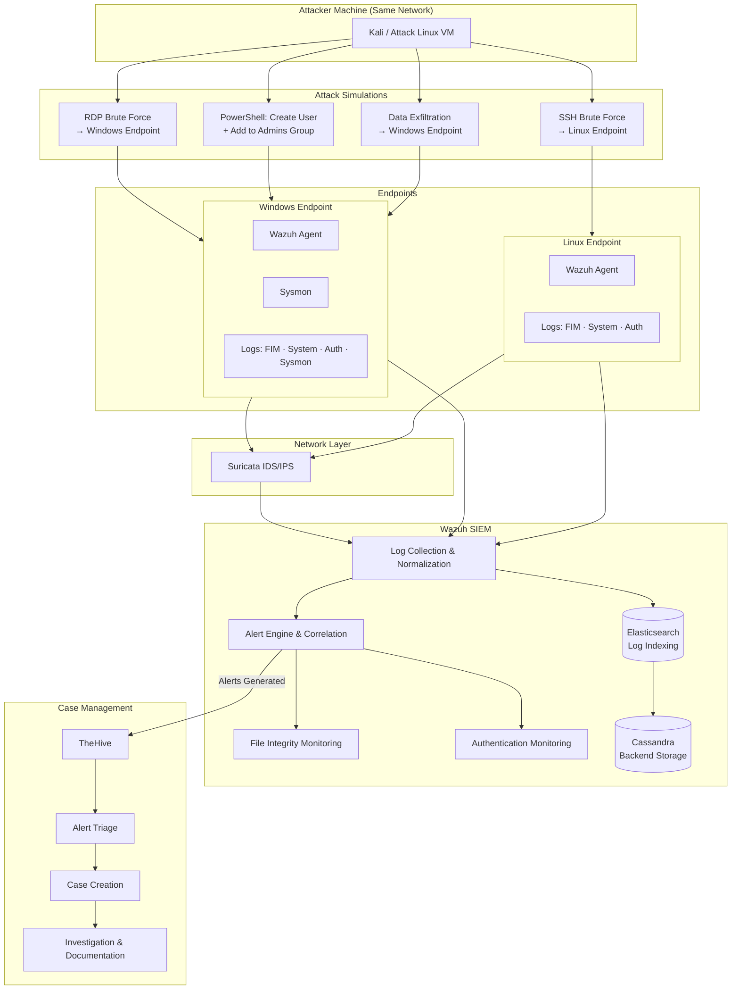

# Security Operations Center (SOC)

<p align="center">


</p>

<p align="center">
A <b>Security Operations Center (SOC)</b> is the centralized unit responsible for<br>
<b>monitoring, detecting, analyzing, and responding to cybersecurity threats</b> in real time.
</p>

---

# Table of Contents

* [What is SOC](#-what-is-soc)
* [SOC-Operations Project](#-soc-operations-project)
* [Project Architecture Flowchart](#-project-architecture-flowchart)
* [Attack Simulations](#-attack-simulations)
* [Incident Response Workflow](#-incident-response-workflow)
* [SOC Objectives](#-soc-objectives)
* [SOC Team Structure](#-soc-team-structure)
* [SOC Architecture](#-soc-architecture)
* [SOC Tools](#-soc-tools)
* [Incident Response Lifecycle](#-incident-response-lifecycle)
* [SOC Workflow](#-soc-workflow)
* [SOC Metrics](#-soc-metrics)

---

# What is SOC

A **Security Operations Center (SOC)** is a dedicated team that continuously monitors an organization's **networks, servers, endpoints, and applications** to detect and respond to cyber threats.

SOC teams operate **24/7** to protect organizations from:

* Malware attacks
* Ransomware
* Insider threats
* Unauthorized access
* Data breaches

The SOC acts as the **central command center for cybersecurity operations**.

---

# SOC-Operations Project

This repository documents the **SOC-Operations** hands-on lab — a fully configured Security Operations Center environment built for real-world threat detection, log correlation, and incident response simulation.

## Infrastructure Stack

| Component | Tool | Role |
|-----------|------|------|
| **SIEM** | Wazuh | Central log collection, correlation, alerting |
| **Search & Storage** | Elasticsearch | Log indexing and fast querying |
| **Backend Storage** | Cassandra | Scalable distributed data storage |
| **IDS/IPS** | Suricata | Network intrusion detection and prevention |
| **Case Management** | TheHive | Incident triage, case tracking, IR workflow |
| **Endpoint Agent** | Wazuh Agent | Installed on both Windows and Linux endpoints |
| **Enhanced Logging** | Sysmon | Deep Windows process/event visibility |

## Endpoints

### Windows Endpoint
- Wazuh Agent + **Sysmon** configured
- Logs collected: FIM, System, Authentication, Sysmon

### Linux Endpoint
- Wazuh Agent configured
- Logs collected: FIM, System, Authentication

---

# Project Architecture Flowchart



---

# Attack Simulations

All attacks were performed from a separate attacker machine on the same network to validate detection coverage.

## Linux Endpoint — SSH Brute Force

```
Attacker Machine
       │
       ▼
SSH Brute Force (multiple failed attempts)
       │
       ├──▶ Auth logs generated on Linux Endpoint
       ├──▶ Wazuh agent forwards logs to SIEM
       ├──▶ Suricata detects anomalous SSH traffic
       └──▶ Wazuh alert fired → TheHive case created
```

## Windows Endpoint — RDP Brute Force

```
Attacker Machine
       │
       ▼
RDP Brute Force (multiple failed attempts)
       │
       ├──▶ Windows Auth logs + Sysmon events generated
       ├──▶ Suricata detects RDP flood pattern
       ├──▶ Wazuh SIEM correlates and fires alert
       └──▶ TheHive case created and triaged
```

## Windows Endpoint — PowerShell: User Creation & Privilege Escalation

```
Attacker Machine (post-access)
       │
       ▼
PowerShell: New-LocalUser + Add-LocalGroupMember -Group "Administrators"
       │
       ├──▶ Sysmon logs: Process creation, PowerShell activity
       ├──▶ Windows Event Logs: User creation, group modification
       ├──▶ Wazuh detects privilege escalation pattern
       └──▶ Alert sent → TheHive case created
```

## Windows Endpoint — Data Exfiltration

```
Attacker Machine
       │
       ▼
Sensitive file movement / transfer simulated
       │
       ├──▶ FIM detects file access/movement
       ├──▶ Suricata flags suspicious outbound traffic
       ├──▶ Wazuh correlates endpoint + network alerts
       └──▶ Exfiltration alert fired → TheHive case triaged
```

---

# Incident Response Workflow

```
1. Attack executed from attacker machine
         │
         ▼
2. Endpoint logs generated (Auth / FIM / Sysmon / System)
         │
         ▼
3. Suricata detects suspicious network traffic
         │
         ▼
4. Wazuh Agent forwards endpoint logs to SIEM
         │
         ▼
5. Elasticsearch indexes all incoming logs
         │
         ▼
6. Wazuh correlates events → Alert generated
         │
         ▼
7. SOC Analyst reviews alert in Wazuh Dashboard
         │
         ▼
8. Alert pushed to TheHive
         │
         ▼
9. Case created and triaged in TheHive
         │
         ▼
10. Investigation performed → Incident documented
```

---

# SOC Objectives

✔ Continuous security monitoring  
✔ Rapid threat detection  
✔ Incident investigation  
✔ Incident response and containment  
✔ Threat intelligence integration  
✔ Security event correlation  
✔ Compliance monitoring  

---

# SOC Team Structure

## Tier 1 — SOC Analyst (L1)

Responsibilities:
* Monitor SIEM alerts
* Perform initial triage
* Identify false positives
* Escalate incidents

Focus: **Alert Monitoring**

---

## Tier 2 — SOC Analyst (L2)

Responsibilities:
* Investigate security incidents
* Perform log correlation
* Conduct malware analysis
* Validate security alerts

Focus: **Incident Investigation**

---

## Tier 3 — SOC Analyst (L3)

Responsibilities:
* Advanced threat hunting
* Root cause analysis
* Attack pattern detection
* Security tool optimization

Focus: **Advanced Threat Detection**

---

## Threat Hunter

Proactively searches for hidden threats using:
* Behavioral analytics
* Threat intelligence
* MITRE ATT&CK techniques

---

## Incident Responder

Handles:
* Containment
* System recovery
* Digital forensics
* Attack mitigation

---

# SOC Architecture

```
                ┌──────────────────┐
                │   Endpoints      │
                │ Servers / Cloud  │
                └─────────┬────────┘
                          │
                          ▼
                 ┌─────────────────┐
                 │   Log Sources   │
                 └────────┬────────┘
                          │
                          ▼
                 ┌─────────────────┐
                 │      SIEM       │
                 │ Log Aggregation │
                 └────────┬────────┘
                          │
                          ▼
                 ┌─────────────────┐
                 │  Alert Engine   │
                 └────────┬────────┘
                          │
                          ▼
                 ┌─────────────────┐
                 │   SOC Analysts  │
                 └────────┬────────┘
                          │
                          ▼
                 ┌─────────────────┐
                 │Incident Response│
                 └─────────────────┘
```

---

# SOC Tools

## SIEM (Security Information and Event Management)

Used for log aggregation and event correlation.

Examples:
* Splunk
* IBM QRadar
* Microsoft Sentinel
* Elastic SIEM

---

## EDR (Endpoint Detection & Response)

Monitors endpoint activity.

Examples:
* CrowdStrike
* SentinelOne
* Microsoft Defender

---

## SOAR (Security Orchestration Automation Response)

Automates security workflows.

Examples:
* Cortex XSOAR
* Splunk SOAR

---

## Threat Intelligence Platforms

Used to identify malicious indicators.

Examples:
* MISP
* Recorded Future
* ThreatConnect

---

# Incident Response Lifecycle

```
Detection
    ↓
Investigation
    ↓
Containment
    ↓
Eradication
    ↓
Recovery
    ↓
Lessons Learned
```

---

# SOC Workflow

```
Logs & Telemetry
        │
        ▼
      SIEM
        │
        ▼
   Alert Generation
        │
        ▼
  L1 Alert Triage
        │
        ▼
  L2 Investigation
        │
        ▼
 Incident Response
        │
        ▼
   System Recovery
```

---

# SOC Metrics

SOC performance is measured using:

| Metric                  | Description                    |
| ----------------------- | ------------------------------ |
| **MTTD**                | Mean Time To Detect threats    |
| **MTTR**                | Mean Time To Respond           |
| **False Positive Rate** | Percentage of incorrect alerts |
| **Incident Volume**     | Number of security incidents   |
| **Containment Time**    | Time to isolate threat         |

---

# SOC Best Practices

✔ Monitor systems **24/7**  
✔ Automate repetitive tasks  
✔ Regularly update detection rules  
✔ Integrate threat intelligence  
✔ Conduct incident response simulations  

---

# Conclusion

A **Security Operations Center (SOC)** is the backbone of modern cybersecurity defense.
It provides **continuous monitoring, rapid threat detection, and coordinated incident response** to protect organizational infrastructure from cyber threats.

---

<p align="center">
💙 If you found this helpful, consider ⭐ starring the repository.
</p>
